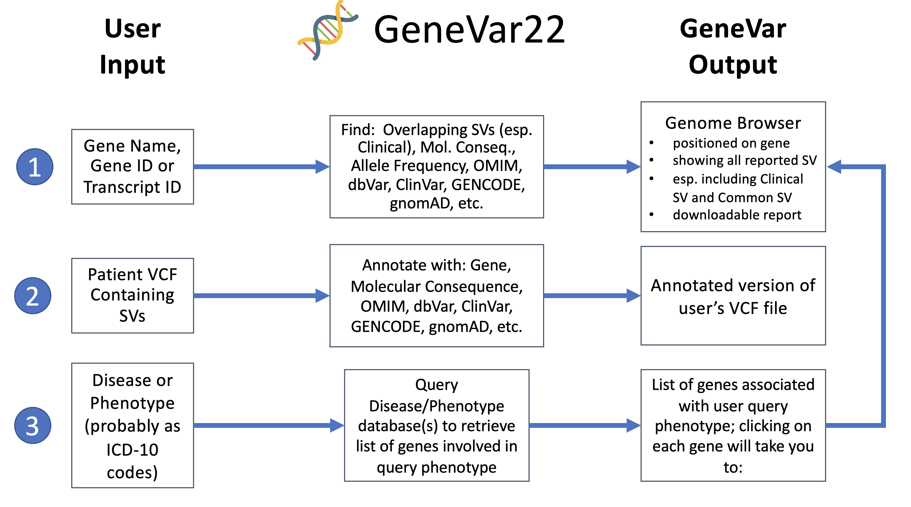

> ## GeneVar(2022 update)
 

  

## Contributors

1. Tim Hefferon 
2. Ahmad Al Khleifat 
3. Rupesh Kesharwani `(Baylor College of Medicine,TX, USA)`
4. Divya Kalra 
5. Kimberly Walker 
6. Priya Lakra 
7. Jianzhi(Quentin) Yang 
8. Jean Monlong 
9. David Henke 
10. Weiyu Zhou 

## Goal

[GeneVar](https://github.com/collaborativebioinformatics/GeneVar) is an open-access, gene centric data browser for structural variants (SVs) analysis. GeneVar takes a gene name as an input or ID and produces a report that informs the user of all SVs overlapping the gene and any non-coding regulatory elements affecting expression of the gene.

[Clinical SV](https://github.com/collaborativebioinformatics/clinical_SVs) is an open access software that can annotate variant call format (VCF) files with clinically relavant information as well as provide useful visualizations such as disease ontology plots.

[GeneVar2](https://github.com/collaborativebioinformatics/GeneVar2) was the integration of these two apps which work together to facilitate reporting of structural variations data. GeneVar tool is intended to have a clinical focus, informing the interpretation of SV pertaining to the gene name. In addition, GeneVar gives the user the option to upload genotyping data and produces a report, a file, and a genome browser session that informs the user of all SVs overlapping the gene, including any non-coding regulatory elements affecting expression of the gene.

**GeneVar(2022 update)** has the added functionality of looking for SVs based upon disease/phenotype ontology.

## How it works?

There are three ways to interact with GeneVar(2022 update):
- First, GeneVar takes a gene name or a gene ID as an input and produces a report that informs the user of all SVs overlapping the gene and any non-coding regulatory elements affecting expression of the gene. 
- Second, users can upload VCF files from their analysis pipelines as an input to GeneVar. GeneVar will output clinically relevant information, as well as provide useful visualizations of disease ontology and enrichment pathway analysis based on SV types. 
- Third, users can submit phenotype or disease ontology terms and retrieve relevant SVs.

## WorkFlow

## Background

Next-generation sequencing (NGS) provides the ability to sequence extended genomic regions or whole-genomes cheaply and rapidly, making it a powerful technique to uncover the genetic architecture of diseases. However, significant challenges remain, including interpretation and prioritization of the found variants and setting up the appropriate analysis pipeline to cover the necessary spectrum of genetic factors (such as expansions, repeats, insertions/deletions (indels), structural variants (SVs) and point mutations). For those outside the immediate field of genetics – researchers, hospital staff, general practitioners, and, increasingly, patients who have paid to have their genome sequenced privately – the interpretation of findings is particularly challenging. Although various tools for the prediction of the pathogenicity of a protein-changing variant are available, they do not always agree, further compounding the problem. Furthermore, with the increasing availability of NGS data, non-specialists are obtaining genomic information without a corresponding ability to analyse and interpret it, as the relevance of novel or existing variants is not always apparent. The same is true of SV analysis, the interpretation of which also requires care related to sample and platform selection, quality control, statistical analysis, results prioritisation, and replication strategy

## Web-App Preview

Screen

## DNAnexus Implementation

### Running RStudio

https://documentation.dnanexus.com/getting-started/developer-tutorials/web-app-let-tutorials/running-rstudio-server

### Developing an RShiny Applet

https://documentation.dnanexus.com/getting-started/developer-tutorials/web-app-let-tutorials/running-rstudio-shiny-server-and-apps

## References

1. https://github.com/collaborativebioinformatics/GeneVar
2. https://github.com/collaborativebioinformatics/clinical_SVs
3. https://github.com/collaborativebioinformatics/GeneVar2

## Future Directions 
- [ ] Permanently Hosted Application
  - [ ] Server
  - [ ] Command Line Tool
